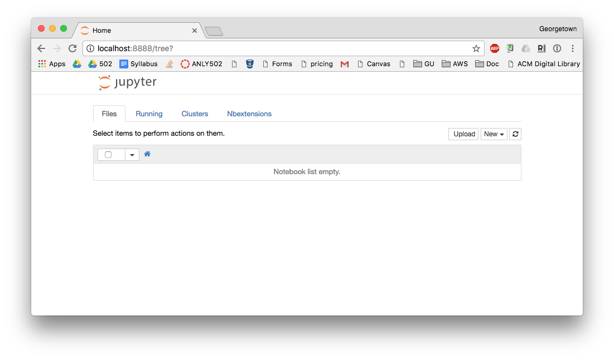
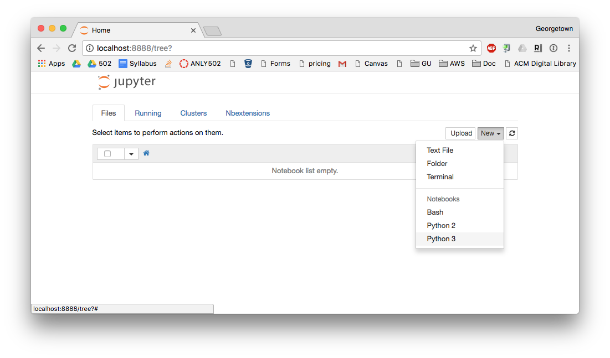
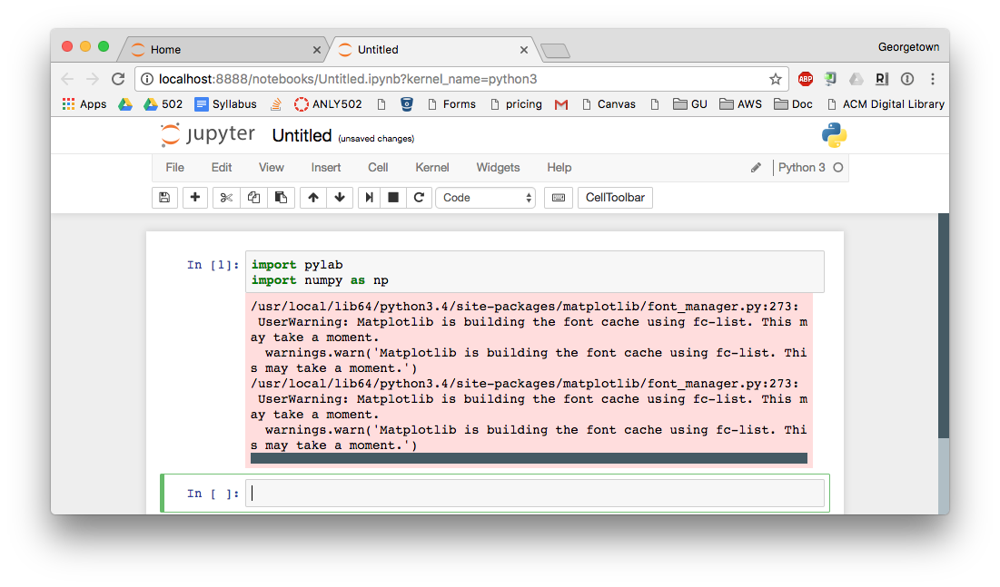
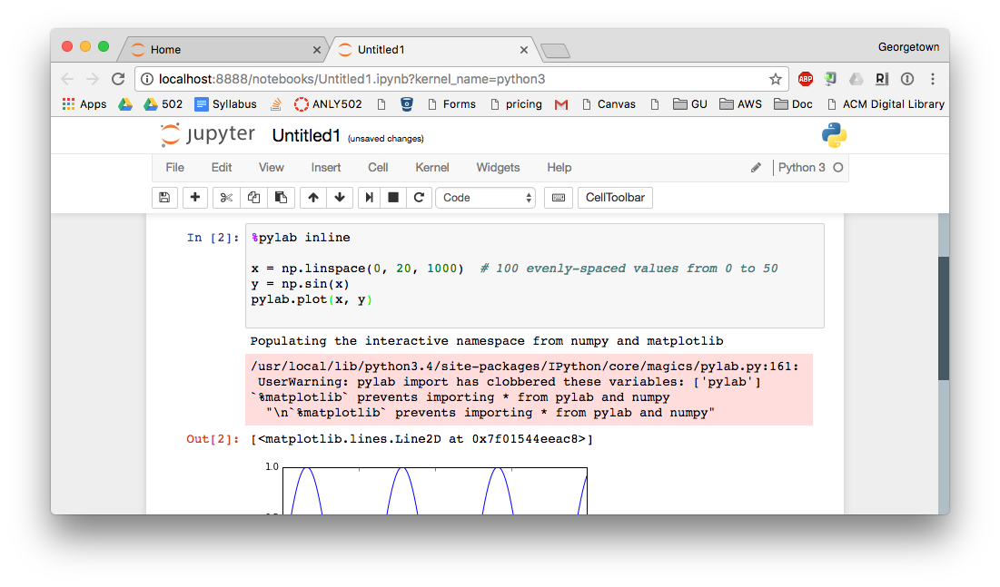
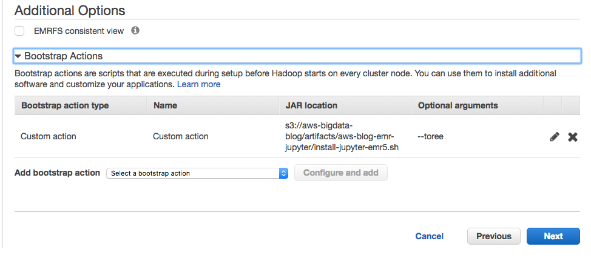
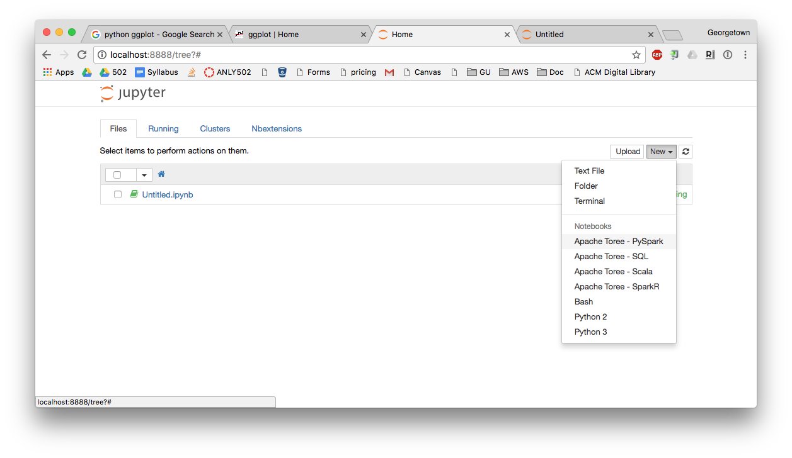
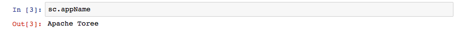

# ANLY 502 Assignment 4
# Due Friday, March 17, 11:00pm

# Tidy Data

In this problem, you will wrangle the output from the [`mtr`](https://en.wikipedia.org/wiki/MTR_(software)) command which is in a different format than the one used in A3 into a [Tidy Dataset](http://vita.had.co.nz/papers/tidy-data.pdf) useful for analysis. 

We will be working with another `mtr` output, this one located at [s3://gu-anly502/A4/mtr.www.cnn.com.txt](s3://gu-anly502/A4/mtr.www.cnn.com.txt).

The output of `mtr` to `www.cnn.com` looks like this. The output is formatted differently, because the output was in text mode, not in CSV mode. Whoops! This sort of thing happens all time in the real world. The text output is designed for humans but not to be machine-readable. Your job is to turn this human-formatted output into something your existing scripts can use.

	Start: Wed Dec 28 23:36:02 2016
	HOST: pidora.local                Loss%   Snt   Last   Avg  Best  Wrst StDev
	  1.|-- 192.168.10.1               0.0%     1    1.6   1.6   1.6   1.6   0.0
	  2.|-- 96.120.104.177             0.0%     1   10.2  10.2  10.2  10.2   0.0
	  3.|-- 68.87.130.233              0.0%     1    9.8   9.8   9.8   9.8   0.0
	  4.|-- ae-53-0-ar01.capitolhghts  0.0%     1   10.8  10.8  10.8  10.8   0.0
	  5.|-- be-33657-cr02.ashburn.va.  0.0%     1   12.9  12.9  12.9  12.9   0.0
	  6.|-- hu-0-10-0-1-pe07.ashburn.  0.0%     1   11.2  11.2  11.2  11.2   0.0
	  7.|-- ???                       100.0     1    0.0   0.0   0.0   0.0   0.0
	  8.|-- ???                       100.0     1    0.0   0.0   0.0   0.0   0.0
	  9.|-- 151.101.32.73              0.0%     1   12.6  12.6  12.6  12.6   0.0
	Start: Wed Dec 28 23:37:02 2016
	HOST: pidora.local                Loss%   Snt   Last   Avg  Best  Wrst StDev
	  1.|-- 192.168.10.1               0.0%     1    1.3   1.3   1.3   1.3   0.0
	  2.|-- 96.120.104.177             0.0%     1    8.7   8.7   8.7   8.7   0.0
	  3.|-- 68.87.130.233              0.0%     1    9.6   9.6   9.6   9.6   0.0
	  4.|-- ae-53-0-ar01.capitolhghts  0.0%     1   10.5  10.5  10.5  10.5   0.0
	  5.|-- be-33657-cr02.ashburn.va.  0.0%     1   14.0  14.0  14.0  14.0   0.0
	  6.|-- hu-0-10-0-1-pe07.ashburn.  0.0%     1   13.7  13.7  13.7  13.7   0.0
	  7.|-- ???                       100.0     1    0.0   0.0   0.0   0.0   0.0
	  8.|-- ???                       100.0     1    0.0   0.0   0.0   0.0   0.0
	  9.|-- 151.101.32.73              0.0%     1   12.6  12.6  12.6  12.6   0.0
	  	  
Let's look at the structure of the file more closely. We first see a
timestamp on the line starting with `Start:`, then we see the starting
hostname on the line starting with `HOST:`, and last we see the series
of hops with the associated data. This pattern repeats itself; the
next instance of `mtr` starts again with the `Start:` line.

The numeric columns mean the following:

- `Loss%` the percentage loss of the packet in that respective hop
- `Snt` the number of packets sent (only one was sent per `mtr` run)
- `Last, Avg, Best, Wrst, StDev` statistics about the time. Since there was only one packet sent all values are equal.

While it is possible to generate a more structured output, like the one we had for A3, the goal of this problem is to practice wrangling skills and create a dataset that is useful for analysis. Another goal is to learn how to deal with and live with faulty or incomplete data: if you look at the hostnames, you either see an IP address or a truncated hostname. This may be all that you have - this is all the information available to us from this output. Another difference between this output format and last week's is that we are seeing the duration quantities in milliseconds rounded off to a tenth. In last week's we had microseconds in whole units.


1) Using [`ingest_mtr.py`](../A3/ingest_mtr.py) from A3 as a reference, write a Python program that processes this raw dataset and creates a tidy and clean dataset. The expected tidy dataset should have the following structure:

`timestamp, hop_number, ipaddr, hostname, pct_loss, time` 

where:

- `timestamp` is the time when `mtr` was run in ISO 8601 format
- `hop_number` is the hop number from the printout
- `ipaddr` is the ip address of the hop. You have this for some of the hosts in the CNN file. For others, you may be able to find the IP address in the file [s3://gu-anly502/A3/mtr.www.comcast.com.2016.txt](s3://gu-anly502/A3/mtr.www.comcast.com.2016.txt).
- `hostname` is the complete hostname. As you can see from the sample data above, the values for the hostname are truncated. Once again, you should see if you can find the complete hostname for each host in the A3 dataset. You will then need to make a lookup table that transforms the incomplete hostname to the complete hostname.
- `pct_loss` is the numeric portion of the Loss% column. Because the `mtr` command was only sending out a single packet, the loss is either 0 or 100.
- `time` is the time the packet took to travel, in milliseconds. This is the `Last` column. Of course, since only a single packet was being sent out, it is also the `Avg` column, the `Best` column, and the `Wrst` column.

Your Python program will need to use some of the tools we discussed in class. Specifically, you will need to use a regular expression to parse each line, and you will need to use an in-memory join to transform the partial hostnames to a complete hostname. (Where do you find the complete hostnames? In our original dataset!)

We have provided you with a skeletal version of the program, which we have called `mtr_fix.py`. Your job is to finish it. We have also provided you with an initial test program, `mtr_fix_test.py`, which you are free to expand.

# Getting to know Spark

In this assignment we will get our first taste of Apache Spark. 

Spark provides for large-scale, complex, and interactive manipulations of massive datasets. It builds upon many of the technologies that we've already learned. Specifically:

* Large datasets can be stored in HDFS or S3.
* Map operations can be applied to every element in a dataset.
* Datasets can be stored as `(key, value)` pairs. 
* Reduce operations can combine multiple elements together.
* A single Master node controls the cluster. You will log into the Master mode to run your programs.

However, we will see some improvements as well:

* You can type interactive commands in Python and see the results immediately.
* You can use `ipython` or Jupyter Notebook to show your results.


## Create your cluster!
In this section you will create a cluster and try out both ipython and Jupyter notebook.

Create an EMR cluster with *Advanced Options* and the following configuration:

* emr-5.3.1
* Hadoop 2.7.3
* Spark 2.1.0
*  Master Nodes: m3.xlarge  count: 1
*  Core Nodes: none
*  Task Nodes: None
*  Cluster Name: Spark 1
*  Options: Logging, Debugging, no Termination Protection
*  Bootstrap Actions: [s3://gu-anly502/bootstrap-spark.sh](s3://gu-anly502/bootstrap-spark.sh)

_Note: this is a different bootstrap!_


Log into the cluster.

## iPython

First we want you to look at iPython, an interactive version of Python that offers completion and history. iPython is similar to the Jupyter notebook, except it runs from the command line.

iPython has been installed on our clusters. To try it, log into one of your existing clusters and type `ipython3`:

    $ ipython3
    Python 3.4.3 (default, Sep  1 2016, 23:33:38) 
    Type "copyright", "credits" or "license" for more information.
    
    IPython 5.1.0 -- An enhanced Interactive Python.
    ?         -> Introduction and overview of IPython's features.
    %quickref -> Quick reference.
    help      -> Python's own help system.
    object?   -> Details about 'object', use 'object??' for extra details.
    
    In [1]: 
    
For a test, set the variable `course` to be `ANLY502`:

    In [1]: course = "ANLY502"
    
    In [2]: 

iPython gives you _tab completion_. To see all of the different methods that the variable `course` implements, type `course.` and then hit the `tab` key:

    In [2]: course. 
                    course.capitalize   course.endswith     course.index        course.isidentifier  
                    course.casefold     course.expandtabs   course.isalnum      course.islower       
                    course.center       course.find         course.isalpha      course.isnumeric    >
                    course.count        course.format       course.isdecimal    course.isprintable   
                    course.encode       course.format_map   course.isdigit      course.isspace       


iPython also provides parenthesis matching, syntax checking, and other features.

Finally, ipython gives you an easy way to to refer to the output of any command. The array `In[]` is an array of all of the strings that are provided as input, while the array `Out[]` is an array of all the outputs. For example, we can capitalize the `course` and then take the result twice together, concatenated:

    In [1]: course = "ANLY502"
    
    In [2]: course.capitalize()
    Out[2]: 'Anly502'
    
    In [3]: Out[2]+Out[2]
    Out[3]: 'Anly502Anly502'
    
    In [4]: In[1]
    Out[4]: 'course = "ANLY502"'
    
    In [5]: 

iPython is a complete shell. You can execute commands such as `ls`, `pwd`, `cwd` and more. It also has powerful search, logging, and command alias facilities. You can get a list of its built-in commands by typing:

    In [14]: quickref
    
    IPython -- An enhanced Interactive Python - Quick Reference Card
    ================================================================
    
    obj?, obj??      : Get help, or more help for object (also works as
                       ?obj, ??obj).
    ?foo.*abc*       : List names in 'foo' containing 'abc' in them.
    %magic           : Information about IPython's 'magic' % functions.
    
    Magic functions are prefixed by % or %%, and typically take their arguments
    ...
    
**Please try all of the examples in this section to make sure that you understand the basis of iPython.**

You can learn more about iPython by [reading the documentation](http://ipython.readthedocs.io/en/stable/index.html) at [http://ipython.readthedocs.io/en/stable/index.html](http://ipython.readthedocs.io/en/stable/index.html).

# Jupyter Notebook on Amazon

Amazon has created a bootstrap action that installs Jupyter notebook on EMR.  The custom bootstrap action is at [s3://aws-bigdata-blog/artifacts/aws-blog-emr-jupyter/install-jupyter-emr5.sh](s3://aws-bigdata-blog/artifacts/aws-blog-emr-jupyter/install-jupyter-emr5.sh).

Create a Spark cluster with EMR with the [s3://aws-bigdata-blog/artifacts/aws-blog-emr-jupyter/install-jupyter-emr5.sh](s3://aws-bigdata-blog/artifacts/aws-blog-emr-jupyter/install-jupyter-emr5.sh) bootstrap action.  **FOR NOW, DO NOT SPECIFY ANY OPTIONAL ARGUMENTS FOR THE BOOTSTRAP ACTION.**

Amazon's `install-jupyter-emr5.sh` bootstrap script causes an EMR5 server to install all of the necessary programs for Jupyter and to start a of Jupyter notebook running on port `8888` of the local computer. You connect to the notebook with a web browser. No authentication is required, which means that anyone who can connect to port 8888 on your EMR's local computer can run commands in the Jupyter notebook. By default your server blocks incoming connections to port 8888. *DO NOT OPEN THIS PORT!* Instead, we will use the `ssh` command to forward port 8888 of your local computer to port 8888 of the EMR server.

Log into the cluster with `ssh` from your laptop. When you log in, you will add the `-L 8888:localhost:8888` option to your `ssh` command line. This option causes the `ssh` command on your local computer to listen to port `8888`, accept connections on that port, and then to forward that to `localhost:8888` on the remote server. 

For example, if your server is running at `ec2-52-87-152-232.compute-1.amazonaws.com`, you would execute the following commands on your laptop:

    $ ssh-add
    $ ssh -L8888:localhost:8888 hadoop@ec2-52-87-152-232.compute-1.amazonaws.com
    ...  
    [hadoop@ip-172-31-46-229 ~]$ 


Now, open a web browser and go to [http://localhost:8888/](http://localhost:8888/). You should see the jupyter notebook's default file browser:



Click "New" and select Python3:



Let's make a simple sin(x) plot with matplotlib.  First, in `In [1]:` enter the following code and then execute the cell (option-return on a mac):

    import pylab
    import numpy as np

You'll see something that looks like this:



Now we will specify that we want the plot to be `inline` (e.g. shown in the jupyter notebook), and then plot y=sin(x)

    %pylab inline
    x = np.linspace(0, 20, 1000)  # 100 evenly-spaced values from 0 to 50
    y = np.sin(x)
    pylab.plot(x, y)

Which produces:

    

**Please try all of the examples in this section to make sure that you can run Jupyter notebook on AWS and log into it.**

## Running Spark 

Now it's time to explore Spark. If you look online, you'll see that most of the Spark examples are still using Python version 2. That's unfortunate, because the world is moving to Python 3. Recall that we are using Python 3 exclusively in this course.

Start up a copy of Python3 connected to Spark. There are three ways to do this, and we will try them all below.

### Method 1 - pyspark

The `pyspark` command runs a copy of the Python interpreter that's connected to the Spark runtime. By default `pyspark` uses Python 2. To run it with Python version 3, use the command `PYSPARK_PYTHON=python3 pyspark`, as below:

    [hadoop@ip-172-31-46-229 ~]$ PYSPARK_PYTHON=python3 pyspark
    Python 3.4.3 (default, Sep  1 2016, 23:33:38) 
    [GCC 4.8.3 20140911 (Red Hat 4.8.3-9)] on linux
    Type "help", "copyright", "credits" or "license" for more information.
    Setting default log level to "WARN".
    To adjust logging level use sc.setLogLevel(newLevel). For SparkR, use setLogLevel(newLevel).
    17/02/19 16:59:20 WARN Client: Neither spark.yarn.jars nor spark.yarn.archive is set, falling back to uploading libraries under SPARK_HOME.
    17/02/19 16:59:37 WARN ObjectStore: Failed to get database global_temp, returning NoSuchObjectException
    Welcome to
          ____              __
         / __/__  ___ _____/ /__
        _\ \/ _ \/ _ `/ __/  '_/
       /__ / .__/\_,_/_/ /_/\_\   version 2.1.0
          /_/
    
    Using Python version 3.4.3 (default, Sep  1 2016 23:33:38)
    SparkSession available as 'spark'.
    >>> 

To verify the version of Spark you are using, examine the variable `sc.version`:

    >>> sc.version
    '2.1.0'
    >>> 

In this course you normally won't run `pyspark` interactively. But you will use the `pyspark` command to run a Spark program as a batch script and store the results in a file.


### Method 2 - iPython
You can use iPython with Spark directly, without using the jupyter notebook. Do this this, you simply run pyspark specifying that the _driver program_ should be `ipython3`:

    [hadoop@ip-172-31-46-229 ~]$ PYSPARK_PYTHON=python3.4 PYSPARK_DRIVER_PYTHON=ipython3 pyspark
    Python 3.4.3 (default, Sep  1 2016, 23:33:38) 
    Type "copyright", "credits" or "license" for more information.
    
    IPython 5.2.2 -- An enhanced Interactive Python.
    ?         -> Introduction and overview of IPython's features.
    %quickref -> Quick reference.
    help      -> Python's own help system.
    object?   -> Details about 'object', use 'object??' for extra details.
    Setting default log level to "WARN".
    To adjust logging level use sc.setLogLevel(newLevel). For SparkR, use setLogLevel(newLevel).
    17/02/19 17:15:10 WARN Client: Neither spark.yarn.jars nor spark.yarn.archive is set, falling back to uploading libraries under SPARK_HOME.
    17/02/19 17:15:25 WARN ObjectStore: Failed to get database global_temp, returning NoSuchObjectException
    Welcome to
          ____              __
         / __/__  ___ _____/ /__
        _\ \/ _ \/ _ `/ __/  '_/
       /__ / .__/\_,_/_/ /_/\_\   version 2.1.0
          /_/
    
    Using Python version 3.4.3 (default, Sep  1 2016 23:33:38)
    SparkSession available as 'spark'.
    
    In [1]:
    
You can demonstrate that Spark is running by displaying the `appName` of the Spark Context:

    In [1]: sc.appName
    Out[1]: 'PySparkShell'
    
    In [2]: 

## Working with pyspark in Jupyter Notebook

To use Spark and Jupyter Notebook together, we need to arrange for the Jupyter kernel to talk to a SparkContext. The modern way to do this is with [Apache Toree](https://toree.apache.org/). Toree uses the iPython protocol to form a connection Spark and Jupyter.  

Fortunately, Amazon's bootstrap script includes support for Toree: all you need to do is add the `--toree` option as a bootstrap argument.

Terminate your cluster, clone it, and create add the `--toree` bootstrap option, as indicated below:



1. Start up the cluster. 
2. SSH into the cluster with port-forwarding enabled. 
3. Open your web browser and connect to [http://localhost:8888/](https://toree.apache.org/).
4. Click on "new" and select Apache Toree - PySpark as below:



You can verify that you are connected to Spark by evaluating `sc.appName:`



 
**Please try all of the examples in this section to make sure that you can run Spark with pyspark, iPython and Jupyter Notebook**

**NOTE: Currently the Amazon bootstrap script only has _Apache Toree - PySpark_ working with Python 2, not with Python 3.**


# Working with Alexa
Amazon maintains a list of the top 1 million Internet sites by traffic at the URL [http://s3.amazonaws.com/alexa-static/top-1m.csv.zip](http://s3.amazonaws.com/alexa-static/top-1m.csv.zip)

In this section you will:

* Download the file
* Make an RDD where each record is a tuple with the (rank, site)
* Determine the number representation of top-level domains (TLDs) in the top 10,000 websites. Example TLDs are `.com`, `.edu` and `.cn`. The first three also also called generic top level domains (GTLDs).
* Build a function that takes a domain and fetches its home page.
* Determine the prevalence of Google Analytics JavaScript on the top 1,000 domains. 
* Scale up the cluster, and determine the prevalence of Google Analytics on the top 100,000 domains.
* Determine which of the websites are using the same Google Analytics account--- which implies that they are run by the same organization.

## Part 1: Download the list of hosts and Demo
Start up an EMR server running Spark and iPython and download the file [http://s3.amazonaws.com/alexa-static/top-1m.csv.zip](http://s3.amazonaws.com/alexa-static/top-1m.csv.zip) using wget.

Unzip the file.

Put the file `top-1m.csv` into HDFS with the command:

    $ hdfs dfs -put top-1m.csv /top-1m.csv
    $ 

Verify that the file is there with `hdfs dfs -ls`.

Run iPython. Make an RDD called `hosts` that contains the contents of the file:

    In [1]: top1m = sc.textFile("/top-1m.csv")
    
There is one element in the RDD for each line in the file. The `.count()` method will compute how many lines are in the file. Run it.

In the file `q1.py` place the Python expression that you evaluated to determine the number of lines in the file.

In the file `q1.txt` place the answer.

###ANSWER

Your file `q1.py` should contain a single line:

    top1m.count()

Your file `q1.txt` should also contain a single line:

    1000000


## Part 2: Count the .com domains!

How many of the websites in this RDD are in the .com domain?

Place the python expression in `q2.py` and the answer in `q2.txt`.

## Part 3: Histogram the TLDs

What is the distribution of TLDs in the top 1 million websites? We can quickly compute this using the RDD function `countByValue()`.

1. Write a function in Python called `tld` that takes a domain name string and outputs the top-level domain.  Save this program in a file called `tld.py`. We have provided you with a py.test test program called tld_test.py that will test it.

2. Map the `top1m` RDD using `tld` into a new RDD called `tlds`. 

3. Evaluate `top1m.first()` and  `tlds.first()` to see if the first line of `top1m` transformed by `tld` is properly represented as the first line of `tlds`. 

4. Look at the first 50 elements of `top1m` by evaluating `top1m.take(50)`. Try the same thing with `tlds` to make sure that the first 50 lines were properly transformed.

5. At this point, `tlds.countByValue()` would give us a list of each TLD and the number of times that it appears in the top1m file. Note that this function returns the results as a `defaultDict` on the master node, not as an RDD. But we want it inverse sorted by popularity  To do this, we can set a variable called `tlds_and_counts` equal to `tlds.countByValue()` and then reverse the order, sort, and take the top 50, like this:

    ```
    tlds_and_counts = domains.countByValue()
    counts_and_tlds = [(count,domain) for (domain,count) in tlds_and_counts.items()]
    counts_and_tlds.sort(reverse=True)
    counts_and_tlds[0:50]
    ```

Store the results of `counts_and_tlds` in a file called `q3_counts.txt`. You can do it with this python:

    open("q3_counts.txt","w").write(str(counts_and_tlds[0:50]))
    
    

Question: `top1m.collect()[0:50]` and `top1m.take(50)` produce the same result. Which one is more efficient and why? Put your answer in the file q3.txt.

**Note: you will need to install py.test on your server using:**

    $ sudo yum pip-2.7 install pytest
    $ sudo yum pip-3.4 install pytest
    
## Part 4: Get a web page
Here is a simple function in both Python2 and Python3 to get a web page. It gets the page using the program `curl` running as a subprocess. 

    def get_url(url):
        from subprocess import Popen,PIPE
        return Popen(['curl','-s',url],stdout=PIPE).communicate()[0].decode('utf-8','ignore')

This assumes that the web page is in ASCII or UTF-8. If it is not, errors are ignored.

Now write a new function called `google_analytics()` that returns False if a page does not use Google Analytics and a True if it does.  How do you know if a page uses Google Analytics?  According to [Google's webpage on the topic](https://support.google.com/analytics/answer/1032399?hl=en), you will see a reference to either _analytics.js_ or _ga.js_.

Store this function in the file `analytics.py`.

**NOTE: DO NOT FETCH ALL 1M web pages!**

Instead, create a new RDD called `top1k` that includes the top 1000 pages:

    top1k = top1m.take(1000)
    
Now, devise an expression that will report which of these top1k web pages obviously use Google Analytics.  Store your expression in `top1k_analytics.py` and the list in `top1k_analytics.txt` 


# What to turn in
Here's the list of what to turn in:

    File                Contents
    -------             ------------
    mtr_fix.py          Program that turns text-formatted MTR records into tinydata
    q1.py               Python expression to evaluate on Spark
    q1.txt              Python expression results, when evaluated on Spark
    q2.py               Python expression to evaluate on Spark
    q2.txt              Python expression results, when evaluated on Spark
    tld.py              Python function
    analytics.py        Python function
    top1k_analytics.py  Python expression
    top1k_analytics.txt Python expression results
    
    


    

# For more Information
If you want more information, you can read and work through the [AWS Big Data Blog](https://aws.amazon.com/blogs/big-data/) entry [Run Jupyter Notebook and JupyterHub on Amazon EMR](https://aws.amazon.com/blogs/big-data/running-jupyter-notebook-and-jupyterhub-on-amazon-emr/). But remember, this blog entry is not a tutorial, so it may take some work to get the notebook and examples operational.


